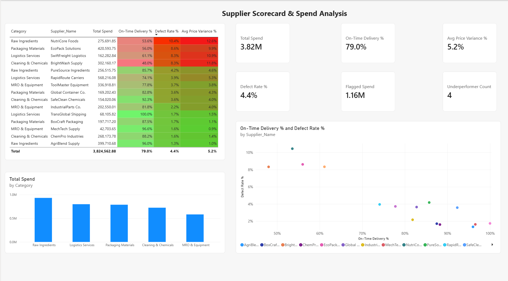

# Supplier Scorecard & Spend Analysis

A Power BI dashboard that scores supplier performance across on-time delivery, defect rate, and price variance against quoted cost — combined with a spend breakdown by category — to automatically flag which suppliers are underperforming and where procurement spend could be consolidated.

## What it does

- **Star-schema data model** — a `Purchase_Orders` fact table (371 purchase orders across 15 suppliers) related to a `Suppliers` dimension table (name, category, country) on `Supplier_ID`.
- **Supplier performance measures** — DAX measures calculate on-time delivery %, defect/rejection rate %, and average price variance % versus quoted cost, for every supplier.
- **Automatic underperformer flagging** — a measure scans all 15 suppliers and flags any that breach acceptable thresholds (below 70% on-time, above 6% defect rate, or above 8% price variance), then totals the dollar spend tied to them — turning "which suppliers look bad" into a hard number instead of a judgment call.
- **Spend breakdown by category** — a bar chart showing where the $3.82M in tracked procurement spend actually concentrates across 5 categories.
- **Performance vs. defect scatter plot** — every supplier plotted by on-time delivery and defect rate, bubble-sized by spend, so a high-spend/low-performance supplier is visually impossible to miss.
- **Conditional formatting scorecard** — a supplier-level table color-coded red-to-green across all three performance metrics.

## Result

Across 371 purchase orders and **$3.82M** in tracked spend, the model automatically flagged **4 of 15 suppliers** as underperforming — representing **$1.16M, roughly 30% of total spend**. It also surfaced a concrete consolidation opportunity: in Packaging Materials, EcoPack Solutions ($420K spend, 56% on-time, 8.6% defect rate) performs far worse than BoxCraft Packaging ($198K spend, 87.5% on-time, 1.7% defect rate) in the same category, despite handling over twice the spend.

## Tools

Power BI Desktop (Power Query, data modeling, DAX measures), Excel (source data prep).

## About the data

The dataset (`Supplier_Spend_Data.xlsx`) is synthetic — built to reflect a realistic spread of supplier performance (a mix of reliable and underperforming suppliers) across 15 suppliers and 5 procurement categories, so the scorecard and flagging logic could be demonstrated end-to-end without proprietary company data.

## Files

| File | Description |
|---|---|
| `Supplier_Scorecard_Dashboard.pbix` | The Power BI report — data model, DAX measures, and all visuals |
| `Supplier_Spend_Data.xlsx` | Source data (`Suppliers` + `Purchase_Orders` tables) |
| `dashboard_screenshot_supplier.png` | Static preview of the finished dashboard |

## Author

Mohamed Seddik Nakbi
[linkedin.com/in/mohamed-seddik-nakbi-74640035b](https://linkedin.com/in/mohamed-seddik-nakbi-74640035b)
